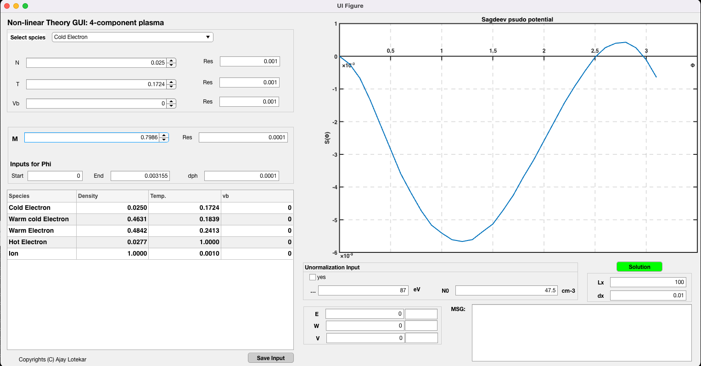
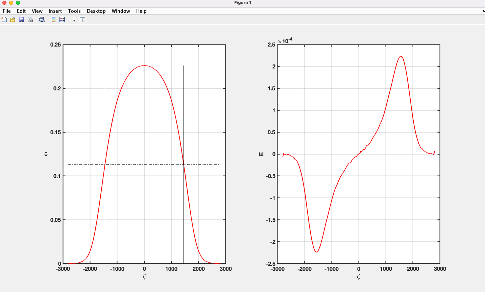

# Non-linear fluid theory (Sagdeev Psudopotential Analysis)

Matlab pakages to do the sagdeev psudoptential analysis of the plasma models


<mark> The project just started. So, I will be modifying the codes heavily in the future (very slowly :) ). Keep looking for the updates. If you have any suggestions feel free to contact. 
</mark>

E-mail: [ablotekar@gmail.com](mailto:ablotekar@gmail.com)

> Table of content.  
* [Graphical User Interface for 5 component plasma](gui_app)
* [Command line interface](command_line_app)

## Graphical User Interface for 5 component plasma

Run follwoing program 

```
./gui_app/Five_component_plasma/Five_component_fluid.mlapp
```

This is how its look.




The solution 



## Command line interface

Run follwoing program

```
./commnad_line_app/Number_of_species.m
```
